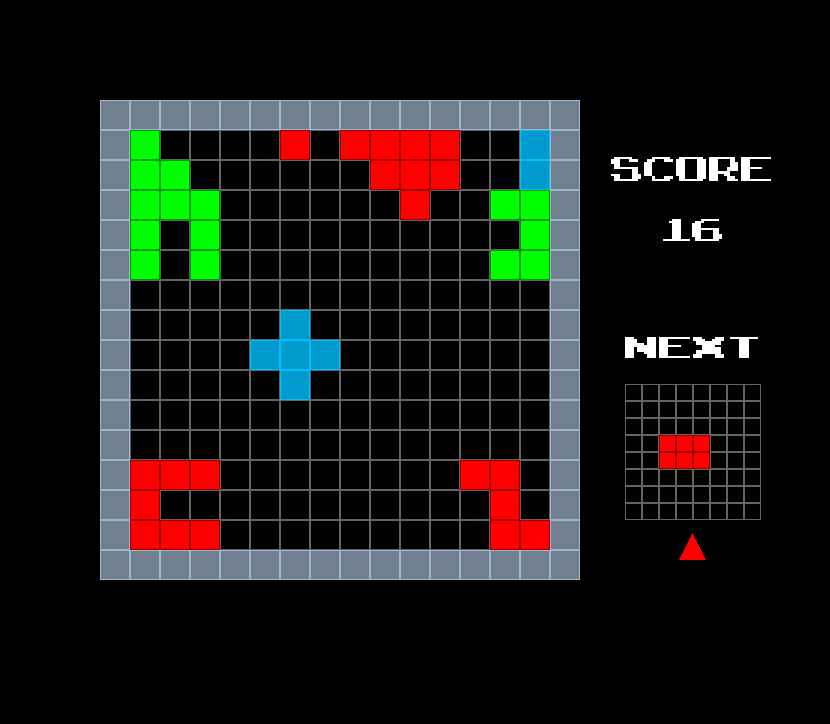

# Staxx-New
New Staxx Code base for visual studio

This is a little game that I wrote in C++ that plays like a tetris game, but in four directions. On each of the sides of the playing area, the player must fill up the lines that make up that direction, as in normal Tetris. When a line is filled, it also disappears and the lines "above" it move "down", but since we are working in four directions, the new line is inserted in the middle of the screen, not at the "top" ("top", "down" and "above" depending on the side of the screen we are referring to here).

The player can also design his/her own shapes. These shapes get stored, and may then be selected, after which that shape will start appearing in-game.

Note that I did not use a UI API for the buttons, etc. I only used SDL2. Therefore I had to design and implement buttons and scrollers myself (which I enjoyed as an exercise, but it is not the most time-efficient way to do things). The benefit of this is that buttons can be customized a lot via the code. I implemented the buttons as clickable tiles that are represented by textures (all tiles were implemented like this). A callback function is called when it is clicked on, which is similar to most UI APIs. Since we use a texture for the appearance of a button, its appearance can be customised to anything.

Should be compilable with Visual Studio 2015. SDL2 should also be referenced in the project, as well as the boost libraries.

Gameplay-wise, the game is pretty difficult with the shapes I have included in this repository. But, users can easily design their own shapes, customizing their gameplay experience.

TODO:

+ Add functionality for deleting shapes from within the program
+ Remember which shapes were selected in a previous run of the program (currently, all shapes are initially selected. The user must select the desired shapes again, after running the program again).

A screenshot of the gameplay screen is shown below.

